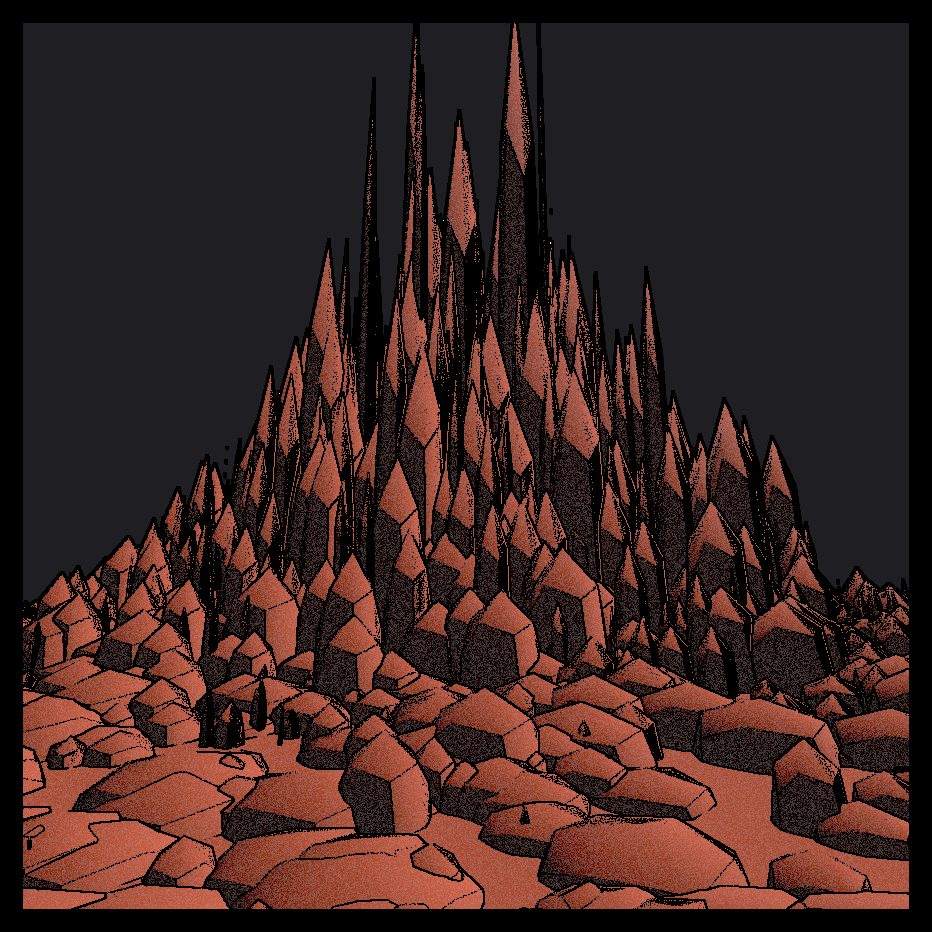

# Crystal Forest
Source code for [https://www.fxhash.xyz/project/crystal-forest-1](https://www.fxhash.xyz/project/crystal-forest-1).

## Run online
Visit [https://nicolasloizeau.github.io/Crystal-forest/](https://nicolasloizeau.github.io/Crystal-forest/). A random drawing is generated each time you refresh the page.

## Run locally
```bash
npx webpack
npx serve
```

## References
[https://github.com/stevinz/three-subdivide](https://github.com/stevinz/three-subdivide)

[https://github.com/mayacoda/pencil-lines](https://github.com/mayacoda/pencil-lines)





